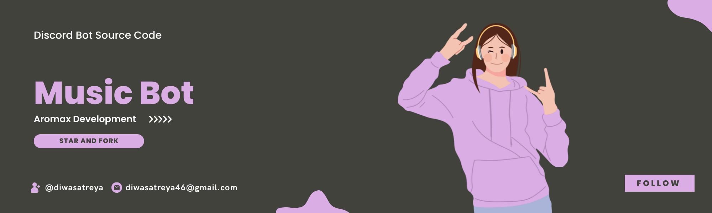

  
  
  

  <h2 align="center">Music Bot</h2>

 Discord music bot with buttons. Play a best quality music.

# Youtube Tutorial
https://www.youtube.com/watch?v=vdmME5pX_ho

# Setup
- Click **Star** in this project
- Add TOKEN in `.env` file
- Fill all the things in `config.json`
- Add Youtube API Key in `config.js`

**Your Bot is ready!**

# Replit Users : 

[Click Here](https://repl.it/github/diwasatreya/Music-Bot) 

# Contact
- Twitter: https://twitter.com/DiwasAtreya
